# HOW TO: Launch Darkly 
In this breakdown we will be going over how to set up and leverage a Launch Darkly project for feature flagging.
> NOTE: This repo contains the finalized for this setup.

## Prerequisites
- [ ] Launch Darkly Account
- [ ] React Project OR you can leverage the existing project in this repo under `react-example` 
- [ ] All necessary dependencies for a React project (IE. Node and etc)

> NOTE: If you are using the example project in this repo, you can run `npm install` to install all the necessary dependencies. It is a typescript project so you will need to have minimal knowledge of typescript to understand the code.

## 🗺 Roadmap
1. Set up 📁 Launch Darkly Project and 🏗 Environment
2. Set up 🛠 Launch Darkly SDK for React
3. Create a 🚩 feature flag in Launch Darkly Console
4. Implement 🛠 feature flag in React
5. Rules 🧐 

## Set up 📁 Launch Darkly Project and 🏗 Environments
Once you are logged into Launch Darkly, you will be greeted with the following screen:

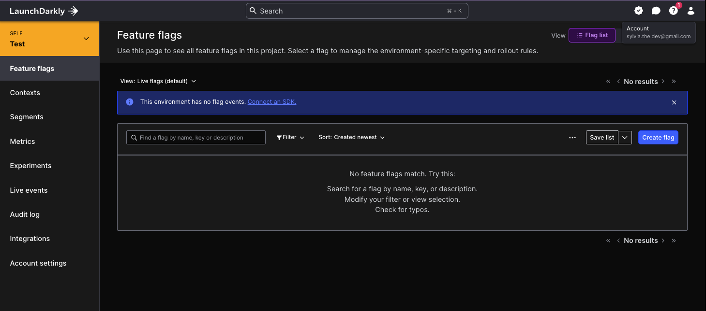
By default, you will be provided a project (name will be based on the organization name you provide during the signup process) with two environments: `Production` and `Test`. You can provide additional environments as needed. This can be done under `Account Settings` -> `Projects` -> `Name of Project` -> `Environments` -> `Add Environment`. 

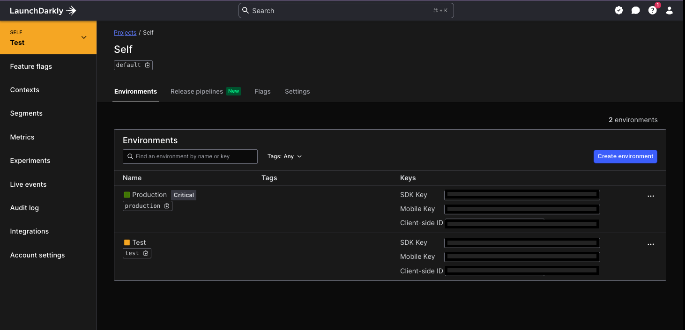
> NOTE: Each of these environments will have their own unique SDK key that you will need to leverage in your application. How that key is loaded will be determined by how your application is split across different environments. 
> 
>As an example: 
> Pipeline points to a specific vault environment which returns the SDK key the run process. This allows the application to load the correct SDK key based on the environment it is being deployed to. 

To set up a new project navigate to `Account Settings` -> `Projects` -> `Create New Project`. You will be greeted with the following screen:

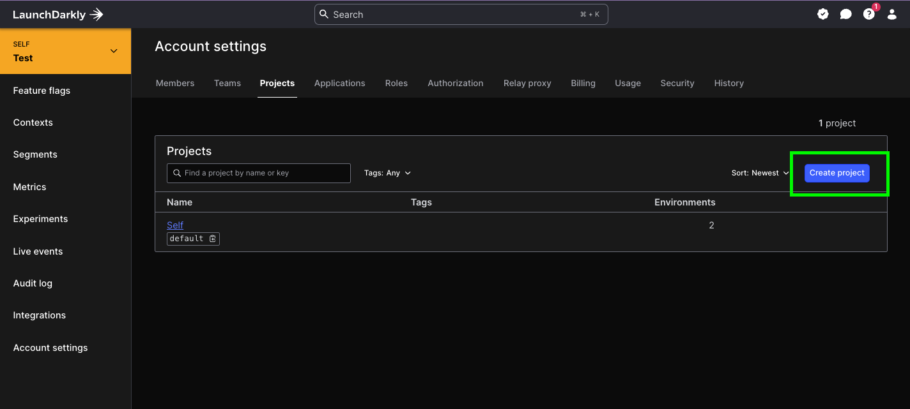

Here you can select create new project and fill in the name of the project you would like to start. 
For  this example we will be creating a project called `HOWTO: Launch Darkly` and let Launch Darkly determine the key.
> NOTE: `Key` is what Launch Darkly uses to identify the project and provide user-friendly urls in the dashboard.

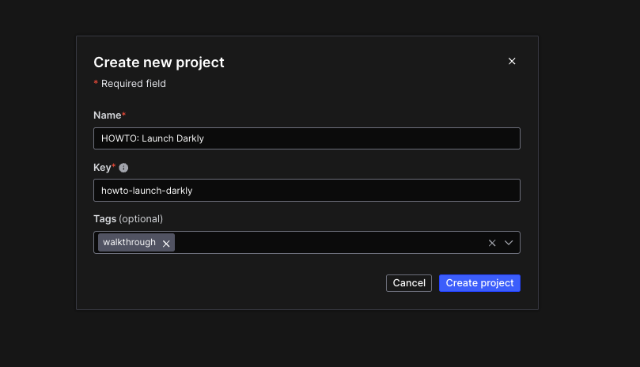

Once the project is created you will be greeted with the following screen.

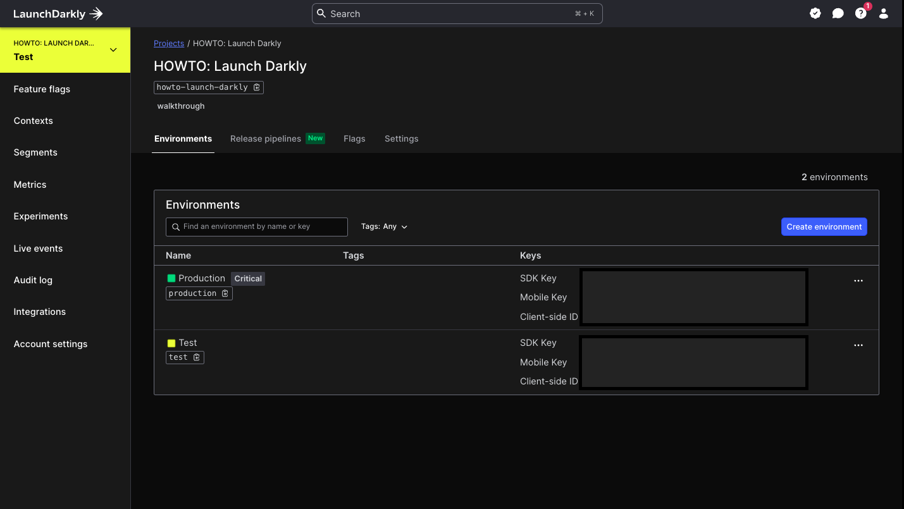
Here we will now have our default environments and project keys available to use. With this information we can set up our React project to leverage the Launch Darkly SDK.

## Set up 🛠 Launch Darkly SDK for React
Our next step is to set up the Launch Darkly SDK in our React project. To do this we will need to install the SDK and set up the configuration to load the SDK and connect to the correct project and environment.

To setup the SDK we will be leveraging the `launchdarkly-react-client-sdk` package. This package provides a variety of hooks and components to interact with the Launch Darkly SDK. 

You can view the package on [npm](https://www.npmjs.com/package/launchdarkly-react-client-sdk). 

Install the SDK by running the following command in your React project directory:
```bash
npm install launchdarkly-react-client-sdk
```
> NOTE: You can use any node package installer you prefer. Here I am using base npm as an example.
> If you are testing with the example project in this repo, you can run `npm install` to install all the necessary dependencies including this one.

Once the package is installed we can now start the setup process.

For this process there are several steps we need to take:
1. Import the Provider
2. Set up the user context with Client Key
3. Wrap the application with the Provider 

### Import the Provider
To import the provider we will need to add the following line to the top of our `index.tsx` file:
```tsx
import { asyncWithLDProvider, LDContext } from 'launchdarkly-react-client-sdk';
```
> NOTE: since we will be creating the context object for the provider I have added the `LDContext` import as well. This is not necessary if you are not using typescript.

This is what we should have so far: 
```tsx
import React from 'react';
import ReactDOM from 'react-dom/client';
import './index.css';
import App from './App';
import reportWebVitals from './reportWebVitals';

// Importing the Launch Darkly provider to wrap our app for access to feature flags
import { asyncWithLDProvider, LDContext } from "launchdarkly-react-client-sdk";

const root = ReactDOM.createRoot(
  document.getElementById('root') as HTMLElement
);

root.render(
  <React.StrictMode>
      <App />
  </React.StrictMode>
);

reportWebVitals();
```

### Set up the user context with Client Key
Now that we have our provider we will need to set up a user context and connect the proper client key to the provider. 

When you set up the context object you will need to provide the following information:
- `clientSideID`: This is the SDK key for the project and environment you are connecting to.
- `context`: This is the user context object that will be used to track the user and will be checked against feature flags for access. This can contain any custom attributes you would like to track.

In the `index.tsx` file we will need to add the following code to set up the user context and connect the client key to the provider.

```tsx
// create the content for the Launch Darkly provider
const context : { clientSideID: string, context: LDContext } = {
  clientSideID: "YourClientSideID",
  context: {
    // REQUIRED: what type of context are we setting
    kind: "user",
    // REQUIRED: add a unique key for tracking that context (every unique key will be tracked)
    key: "user-access-ExampleUser",
    // OPTIONAL: define custom attributes for the user context to track in LD
    username: "ExampleUser",
    region: "US",
    enrolledInBeta: true,
  },
};
```
> NOTE: You will need to replace `YourClientSideID` with the key for the project and environment you are connecting to.

### Wrap the application with the Provider

Now that we have our context object set up we can now wrap our application with the provider and connect to Launch Darkly. 

To do this we will need to add the following code to the `index.tsx` file:

```tsx
// We are wrapping in an async iffy to use async/await
(async ()=> {
  // instance the provider with the context
  // because we are using async/await we need to await the provider
  const  LDProvider =  await asyncWithLDProvider(context);

  const root = ReactDOM.createRoot(
    document.getElementById('root') as HTMLElement
  );

  root.render(
    <React.StrictMode>
      {/* Wrap application with provider so feature flags are available */}
      <LDProvider>
        <App />
      </LDProvider>
    </React.StrictMode>
  );

  reportWebVitals();
})();
```

This is what our `index.tsx` file should look like now:
```tsx
import React from 'react';
import ReactDOM from 'react-dom/client';
import './index.css';
import App from './App';
import reportWebVitals from './reportWebVitals';

// Importing the Launch Darkly provider to wrap our app for access to feature flags
import { asyncWithLDProvider, LDContext } from "launchdarkly-react-client-sdk";

// We are wrapping in an async iffy to use async/await
(async ()=> {
  // create the content for the Launch Darkly provider
  const context : { clientSideID: string, context: LDContext } = {
    clientSideID: "YourClientSideID",
    context: {
      // REQUIRED: what type of context are we setting
      kind: "user",
      // REQUIRED: add a unique key for tracking that context (every unique key will be tracked)
      key: "user-access-ExampleUser",
      // OPTIONAL: define custom attributes for the user context to track in LD
      username: "ExampleUser",
      region: "US",
      enrolledInBeta: true,
    }
  };

  // pass the context into the Provider
  const  LDProvider =  await asyncWithLDProvider(context);

  const root = ReactDOM.createRoot(
    document.getElementById('root') as HTMLElement
  );

  root.render(
    <React.StrictMode>
      {/* Wrap application with provider so feature flags are available */}
      <LDProvider>
        <App />
      </LDProvider>
    </React.StrictMode>
  );

  reportWebVitals();
})();
```
You should now see the following in your chrome console:
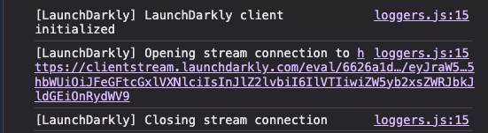

At this point we have set up the Launch Darkly SDK in our React project and connected it to the project and environment we set up in the Launch Darkly console. 🎉 


## Create a 🚩 feature flag in Launch Darkly Console
Now that we have our application setup we can now create a feature flag in the Launch Darkly console.

To create a feature flag navigate to the Launch Darkly dashboard and select the project you would like to create the feature flag in.

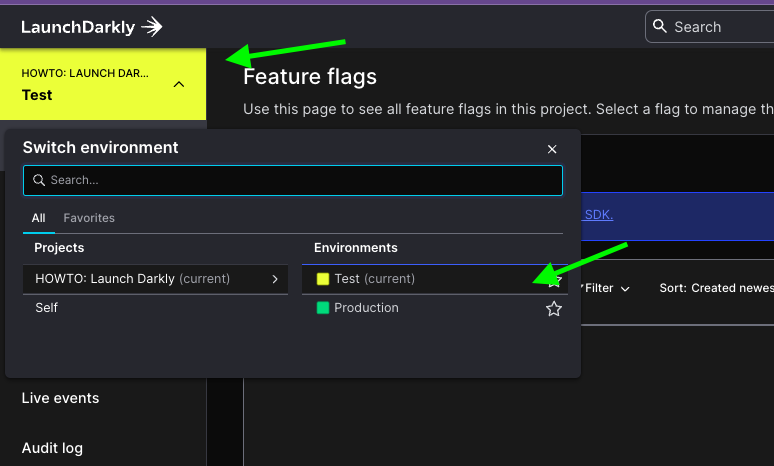

Once you have selected the project you will be greeted with the following screen to view your feature flags. To start creating a feature flag select the `Create Flag` button in the top right corner of the screen.

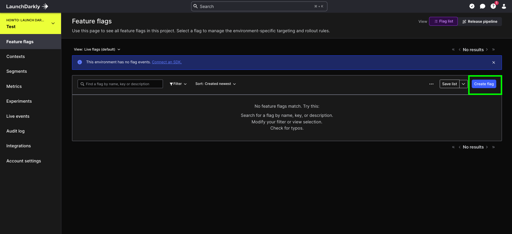

> 🛑 STOP: 
> 
>Before we continue, let's take a moment to understand what a feature flag is and how it can be used.
> 
>A feature flag is a way to control the visibility of a feature in your application. This can be used to control the visibility of a feature based on a variety of factors such as user context, environment, or any other custom attribute you would like to track. 
> For Example: 
> We have a set of features that we would like to only be made available to users who have opted in.
> We can wrap a feature in a feature flag and set the flag to only be visible to users who have the `enrolledInBeta` attribute set to `true`.
> Another example would be to control the visibility of a feature based on the region the user is in.
> 
> Once you have determined your use case for the feature flag you can now create the flag in the Launch Darkly console.

In the following example we will be setting up a feature flag to control the visibility of a component in our React application.
This feature flag will be called `sales-highlight` and will control the visibility of the sales gallery within our application. 

Our Application to start: 
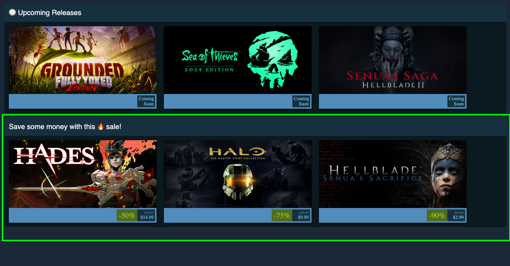 

This green box is the sales gallery component that we would like to control the visibility of.

On the `Create Flag` screen you will be greeted with the following screen to set up the feature flag. 
This screen is broken down into 3 parts: 
1. Flag Details
   - Name: This is the name of the feature flag
   - Key: This is the key that will be used to reference the feature flag in the SDK
   - Description: This is a description of the feature flag
   - Maintainer: This is the person who is responsible for maintaining the feature flag
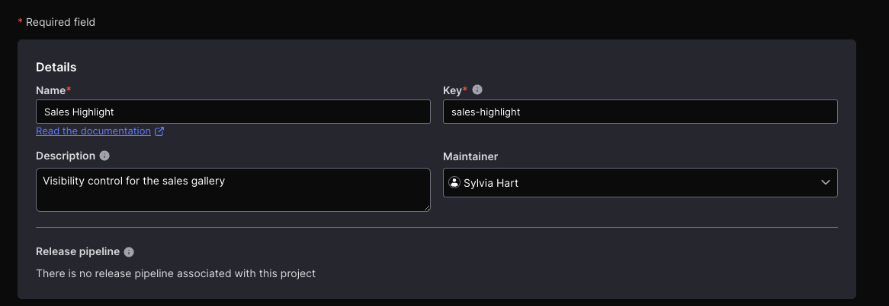
2. Configuration
   - This is where you will set up the configuration for the feature flag. 
   - For this example we will create a simple custom boolean flag
   - Variations: This is the different variations of the flag. In this case we will have `true` and `false` variations.
   - Each variation will have a description to help understand what the variation is for.
   - Set default variation: This is the default variation that will be used if the flag is not targeted.
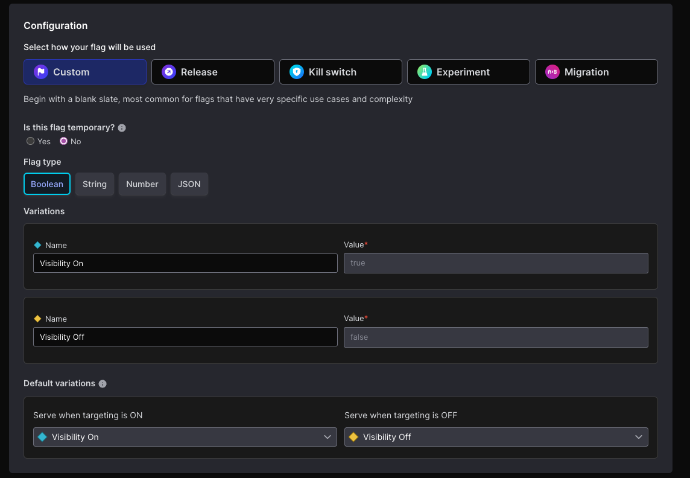
3. Additional Configuration
- This is where you can set up additional configurations for the feature flag. We can tag the flag for easier searching and set up targeting rules for the flag.
- Make sure to enable the flag for the client side SDK to be able to access the flag in the application.
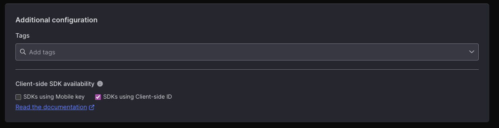
>NOTE: You MUST enable the flag for the client side SDK to be able to access the flag in the application. This is found under the `Client-side SDK availability` section.

You can now save the flag, and you will be greeted with the following screen:
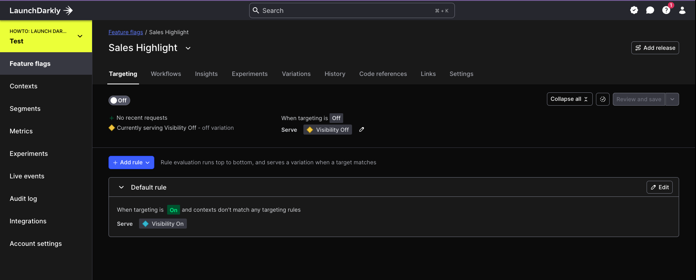

You have now created a feature flag in Launch Darkly. You can now implement this flag in your React application. 🙌🏻   

## Implement 🛠 feature flag in React

Now that we have our feature flag set up in Launch Darkly we can now implement the flag in our React application.

To implement the flag we will need to use the `useFlags` hook provided by the Launch Darkly SDK. This hook will allow us to access the feature flag and determine the visibility of the component based on the flag.

To implement the flag we will need to do the following:
1. Import the `useFlags` hook
2. Use the `useFlags` hook to access the feature flag
3. Determine the visibility of the component based on the flag

### Import the `useFlags` hook
To import the `useFlags` hook we will need to add the following line to the top of our `App.tsx` file:
```tsx
import { useFlags } from 'launchdarkly-react-client-sdk';
```

### Use the `useFlags` hook to access the feature flag
Now that we have the `useFlags` hook imported we can now use it to access the feature flag.
> NOTE: The `useFlags` hook will return an object with all the feature flags available to the user context.  
```tsx
function App() {
   // Use the useFlags hook to get the value of the feature flags
   const flags = useFlags();
   return (
           <div className="App">
              <HorizontalCardGallery title={"🕐 Upcoming Releases"} products={products_upcoming} />
              <HorizontalCardGallery title={"Save some money with this 🔥 sale!"} products={products_sale} />
           </div>
   );
}
```

### Determine the visibility of the component based on the flag
Now that we have the feature flag we can now determine the visibility of the component based on the flag. 
To do this we will need to add a conditional statement to determine if the component should be visible or not. 
```tsx 
function App() {
   // Use the useFlags hook to get the value of the feature flag
   const flags = useFlags();

   return (
           <div className="App">
              <HorizontalCardGallery title={"🕐 Upcoming Releases"} products={products_upcoming} />
              {/* Conditional for validating the boolean value of the flag */}
              {flags.salesHighlight && <HorizontalCardGallery title={"Save some money with this 🔥 sale!"} products={products_sale}/>}
           </div>
   );
}
```

And just like that we have implemented a feature flag in our React application! Wild right? 
If we look at our application now we can see that the sales gallery component is no longer visible.

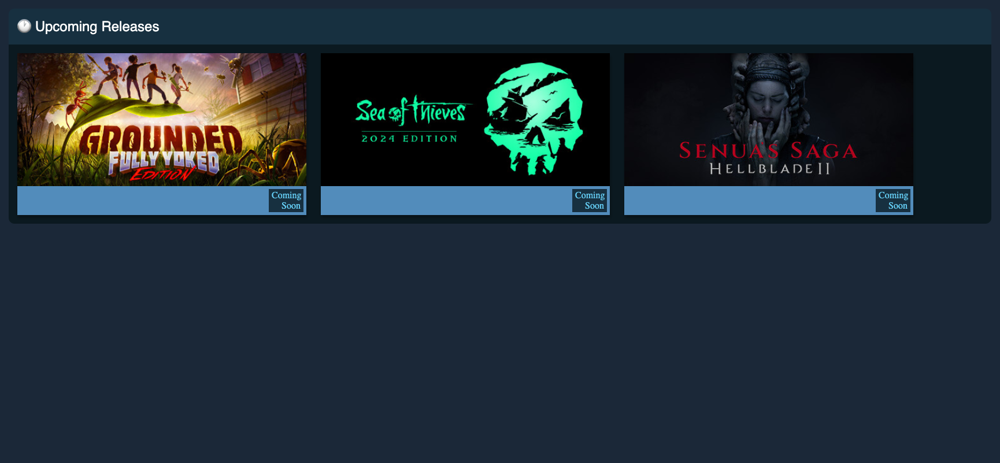

Final step... Rules! 

### Rules 🧐
